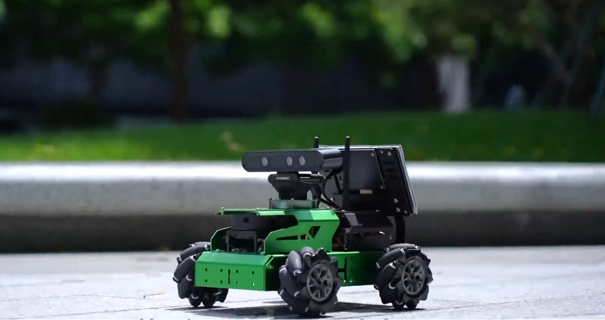

# JetAuto

English | [中文](README_cn.md)

  

## Product Overview

###🚀 Why JetAuto Exists

Navigating the gap between robotics theory and tangible, intelligent systems is hard. Simulators lack physical feedback, while building a capable robot from scratch is a massive undertaking.

JetAuto solves this. It’s a high-performance, Jetson-powered robot car engineered from the ground up for ROS-based development and Embodied AI research. We’ve integrated the essential sensors—LiDAR, 3D depth camera, microphone array—and the computational power of NVIDIA Jetson into a robust Mecanum-wheel chassis. This isn't just a kit; it's a complete, open-platform research vehicle designed to transform your algorithms for navigation, vision, and interaction from code into real-world action.
###✨ Core Capabilities at a Glance

JetAuto is built to tackle the core challenges of modern autonomous systems:
🧠 Jetson-Powered AI Edge: Choose from Jetson Nano, Orin Nano, or Orin NX as the brain. Fully compatible with ROS 1 & ROS 2, and accelerated by TensorRT for real-time deep learning inference.

🗺️ Professional-Grade Navigation: Achieve precise autonomy with sensor fusion. Use LiDAR with algorithms (gmapping, cartographer) for 2D SLAM, and the 3D depth camera for RTAB-Map-based 3D mapping and point cloud processing.

👁️ Advanced 3D Vision Perception: Move beyond 2D. The RGB-D camera enables object recognition, person following, and scene understanding in three dimensions, forming a critical layer for spatial AI.

🤖 Multimodal AI Interaction: Redefine human-robot interaction. The integrated 6-mic array and vision system connect to multimodal large models (like ChatGPT), enabling natural voice commands and context-aware reasoning for embodied AI applications.

🌀 Full-Omnidirectional Mobility: The Mecanum wheel chassis allows the robot to slide laterally, rotate in place, and move in any direction without changing heading, enabling complex maneuvers in tight spaces.
## Demo Videos

### Your Ideas, In Action
- **JetAuto ROS Robot Car Powered by Jetson Nano with Lidar Depth Camera Touch Screen**: [Watch](https://www.youtube.com/watch?v=vm51ssb62J4)
- **🚀 New Release Alert! 🚀JetAuto has just dropped the Raspberry Pi 5 and Jetson Orin Nano versions!**: [Watch](https://www.youtube.com/shorts/gVZnxNP4630)
- **No road signs 🚦will be left unspotted on this automated road trip💨**: [Watch](https://www.youtube.com/shorts/LY9oAYXwSL0)

## Hackster Projects

- **JetAuto: Platform for AI-Powered, Self-Navigating Robots**: [Read](https://www.hackster.io/HiwonderRobot/jetauto-platform-for-ai-powered-self-navigating-robots-d38975)
- **JetAuto: The All-in-One Real-World Robotics Platform**: [Read](https://www.hackster.io/HiwonderRobot/jetauto-the-all-in-one-real-world-robotics-platform-f21553)
- **Unboxing & Review - JetAuto ROS Robot Car**: [Read](https://www.hackster.io/HiwonderRobot/unboxing-review-jetauto-ros-robot-car-c97bc4)
- **YOLO v8 : Autonomous Driving Scenario of JetAuto ROS Robot**: [Read](https://www.hackster.io/490575/yolo-v8-autonomous-driving-scenario-of-jetauto-ros-robot-037583)

- 
## Official Resources

### Official Hiwonder

- **Official Website**: [https://www.hiwonder.com/](https://www.hiwonder.com/)
- **Product Page**: [https://www.hiwonder.com/products/jetauto](https://www.hiwonder.com/products/jetauto)
- **Official Documentation**: [https://docs.hiwonder.com/projects/JetAuto/en/latest/](https://docs.hiwonder.com/projects/JetAuto/en/latest/)
- **Technical Support**: support@hiwonder.com

## Getting Started

### Installation

Refer to the [official documentation](https://docs.hiwonder.com/projects/JetAuto/en/latest/) for detailed installation instructions specific to your hardware platform.

## Community & Support

- **GitHub Issues**: Report bugs and request features
- **Email Support**: support@hiwonder.com
- **Documentation**: Comprehensive guides and tutorials

## License

This project is open-source and available for educational and research purposes.

---

**Hiwonder** - Empowering Innovation in Robotics Education
